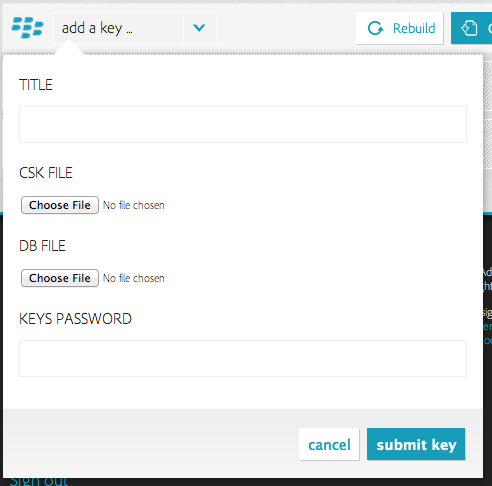

# Importing Your BlackBerry Signing Keys

Adobe® PhoneGap™ Build currently provides a default BlackBerry development version for all users, which provides an Over-The-Air install for your PhoneGap applications. However, to distribute your own BlackBerry applications, you will need to register with RIM for your own keys, and then import those keys into PhoneGap Build.

To register, fill out [the form on RIM's site](https://www.blackberry.com/SignedKeys/), and, once you receive your keys, follow the installation process locally.

__Important Note__: PhoneGap Build currently just supports _Smartphone_ BlackBerry builds, not _Tablet_ builds. Make sure the keys you get, and subsequently import, are smartphone keys.

## Finding Your Keys

Once your keys are installed on your own system, you can retrieve them and submit them to PhoneGap Build. The process is simple.

1. Find the SDK directory where you installed your keys
-------------------------------------------------------

### Installed using Eclipse

    C:\Eclipse-3.5.2\plugins\net.rim.ejde.componentpack5.0.0_5.0.0.25\components\

- Eclipse directory path may differ from `C:\Eclipse-3.5.2\`
- Plugin component path may differ from `net.rim.ejde.componentpack5.0.0_5.0.0.25`
    - General format is net.rim.ejde.componentpackX.X.X_X.X.X.X

### Installed BlackBerry Widget/WebWorks Packager Standalone SDK

    # 32-bit
    C:\Program Files\Research In Motion\BlackBerry Widget Packager\

    # 64-bit
    C:\Program Files (x86)\Research In Motion\BlackBerry Widget Packager\

    # PhoneGap Wiki suggestion
    C:\bbwp\

2. Find your code-signing files
-------------------------------

    C:\SDK_PATH\bin\sigtool.csk
    C:\SDK_PATH\bin\sigtool.db

`sigtool.csk` appears to contain your database private key and salt. In other words, your password and the random mouse and keyboard input that you assigned during the installation.

`sigtool.db` appears to contain your credentials for connecting to RIM's servers.

## Importing your keys to PhoneGap Build

**PhoneGap Build** requires both these files to build and sign your applications.

To do so, go to [your profile page](/people/edit), scroll down to _Signing Keys_ and, under _BlackBerry_, hit _add a key_.

  

Ensure that the password you enter is the same one you entered when installing the keys locally. The title can be anything - something that helps you identify which keys they are.

Once the key is installed, you can set it as your default BlackBerry key (so all BlackBerry builds will automatically use it), or you can use it on an app by app basis. Happy building!
