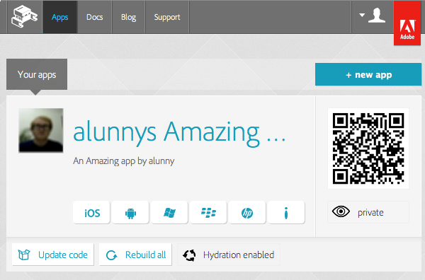

# Git Hosting

  _Note: we are phasing out Adobe® PhoneGap™ Build hosted Git repositories. We will continue to support the repositories that you have already created, but will not allow the creation of new ones._

  PhoneGap Build now provides authenticated Git hosting for your apps. This allows you to easily add PhoneGap Build integration to your existing workflow, without exposing any personal credentials, or authenticaing us to your private repositories.

  This document offers a sample workflow for using PhoneGap Build with Git. However, one of the advantages of using Git is that you can use any tooling you choose to work with, whether that's a UI on top of Git or any plug-ins/integration with IDEs you're familiar with. You can even use a different version control system for your project, and just use a tool like `git-svn` to push your work up to PhoneGap Build.

  First, set up your user account to ensure we can authenticate you correctly. Go to the [user admin](/people/edit) and ensure the __Username__ field is filled in (we use your username to generate a unique url for your repository. You will also need to enter a __Public SSH Key__ for our Git server to authenticate you. You can use the `ssh-keygen` utility, if that's on your system, to generate an SSH key - please consult documentation for your platform otherwise.

  Once that's complete, you'll want to create your new repository. Go to your [apps listing](/apps) page, and hit __New App__. Enter your app's title, and select _create a new git repository_, then hit __Upload__.

  You can see that the app hasn't started building, because we don't have an app to build yet. So the next step is to create your application.

  Create a new directory on your file system with an `index.html` file in there. Initialize a Git repository in that directory - this will allow you to push your application to PhoneGap Build to start up your builds. Your workflow would look something like this:

    ~ $ mkdir git-hosted-app
    ~ $ cd git-hosted-app/
    ~/git-hosted-app $ git init
    Initialized empty Git repository in /Users/andrewlunny/git-hosted-app/.git/
    ~/git-hosted-app $ echo "<h1>Hello World</h1>" > index.html
    ~/git-hosted-app $ git add .
    ~/git-hosted-app $ git commit -m "initial commit"
    [master (root-commit) 929f0d6] initial commit
     1 files changed, 1 insertions(+), 0 deletions(-)
     create mode 100644 index.html

  You can see from our [Getting Started](/docs/start) that we recommend putting a bit more in your app - a `config.xml` and an `icon.png` for starters - but that's not necessary for this Hello World app. The next step is to push your app to PhoneGap Build. Add the URL we've provided as a remote, and then push your master branch:

    ~/git-hosted-app $ git remote add phonegap git@git.phonegap.com:zubzub/61_GitHostedApp.git
    ~/git-hosted-app $ git push phonegap master
    Counting objects: 3, done.
    Writing objects: 100% (3/3), 227 bytes, done.
    Total 3 (delta 0), reused 0 (delta 0)
    remote: updating repo zubzub/61_GitHostedApp
    To git@git.phonegap.com:zubzub/61_GitHostedApp.git
     * [new branch]      master -> master
    
  The remote name `phonegap` is arbitrary - you could say `git remote add gitgap git@git.phonegap.com:zubzub/61_GitHostedApp.git`, or any other remote name you choose.

  At any rate, your app has not been received by PhoneGap Build and your apps are queued up for building. In a few minutes, they're all set and ready to download.

  

  At this stage, you can download your apps, test them out, see what works and what doesn't, and make some changes. When you want your changes to be built, ensure those changes have been committed to your local git repository, and then hit `git push` once more.

    ~/git-hosted-app $ git commit -m "fixed phone explosion bug"
    [master 57c6c11] fixed phone explosion bug
     1 files changed, 0 insertions(+), 42 deletions(-)
    ~/git-hosted-app $ git push phonegap master
    Counting objects: 5, done.
    Writing objects: 100% (3/3), 288 bytes, done.
    Total 3 (delta 0), reused 0 (delta 0)
    remote: updating repo zubzub/61_GitHostedApp
    To git@git.phonegap.com:zubzub/61_GitHostedApp.git
       b6ea0d9..57c6c11  master -> master

  Now switch back to your browser and you should see the app in a "pending" state - PhoneGap Build has queued up your app again, and it should be ready to rock soon.
