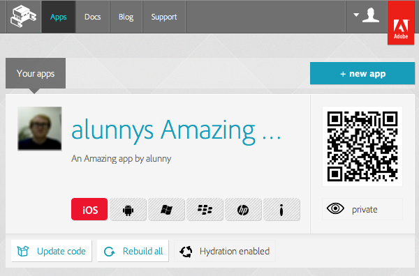
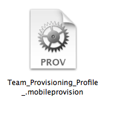
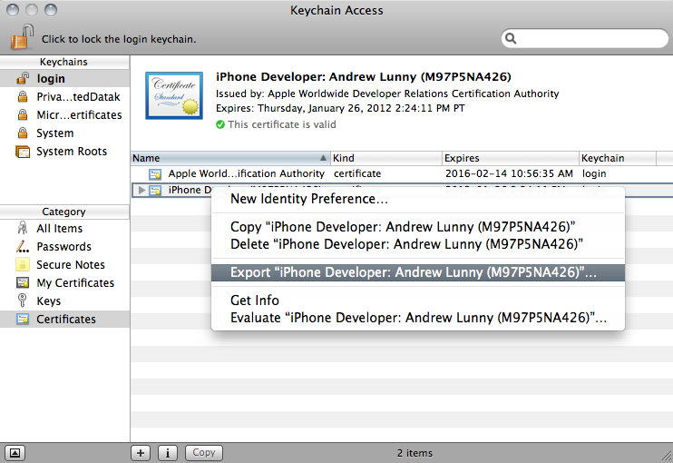
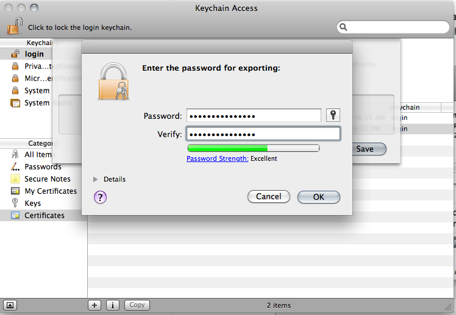
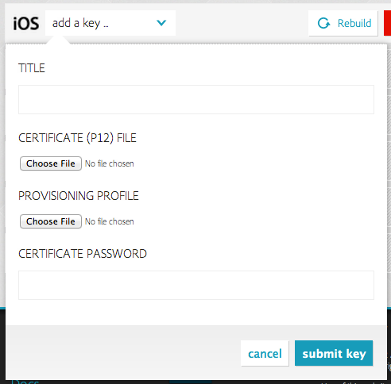

# Building for iOS

  We're now able to offer support for building to iOS devices through Adobe® PhoneGap™ Build. The process for completing iOS builds is slightly different than that for other platforms: all iOS builds need to be signed by a developer certificate and a provisioning profile, that is tied to your Apple developer account and the device you wish to test on. This document covers how to set this up.

> Note: Since PhoneGap Build uses Apple's standard development process to build applications, you will need to sign up for their developer program to build iOS applications on PhoneGap Build. You will also need a Mac to configure your certificate and provisioning profile.

  When you upload a new application to PhoneGap Build, if you don't have a default certificate-profile pair attached to your account, you will be alerted that the iOS build can not be completed:

  

  Your key will actually consist of two files: a **certificate** and a **provisioning profile**. Apple has [extensive documentation](http://developer.apple.com) for setting up your environment locally: the best approach is to ensure you can build an iOS application to your iOS device locally, to be sure that both your certificate and your provisioning profile are set up correctly for code signing.

  Once you have these set up, you can export them for upload to PhoneGap Build. For the provisioning profile, you will need a file with the `mobileprovision` extension, which looks like this:

  

  Ensure that this provisioning profile is correctly paired with the device(s) you wish to test on.

  Note that when you create your profile, you will specify the App IDs that are linked to the profile. This is important when using PhoneGap Build: the package name you specify for your app, in your `config.xml` (the `id` attribute of the `widget` element) or through the Edit App page, will have to match the ID for the provisioning profile. If they fail to match, your app will not be built correctly.

  Apple appends a "Bundle Seed ID," or "App ID Prefix," to the provisioning profile when you generate it through the iOS Developer Center. Note that you do _not_ to include this App ID Prefix in your `config.xml` for PhoneGap Build to build successfully. You just need the reverse-domain style Bundle Identifier - `com.domainname.appname`. This will also be best compatible with building for other platforms.

  To prepare your certificate, you will need to open the **Keychain Access** utility on your Mac, and identify the certificate that you use for iOS development. Right click on that certificate and select *Export ...*

  

  Save the certificate in a location you can remember, and enter a password. Remember the password: you will need to give it to PhoneGap Build, otherwise we cannot use your certificate.

  

  Now back to the website. On the app detail page, simply select the "new key..." option from the signing key dropdown for the app in question, and then, from the list of platforms with signing available, hit *add a key* for iOS. Fill out the form: add your `p12` certificate file and your `mobileprovision` file, and enter the password associated with your certificate.

  

  Once your key is added, we'll attempt to rebuild the application for iOS. If all goes well, you should see a link for the built `ipa` file available.

  You can then download the `ipa` file and use iTunes to install it directly on your provisioned iOS device.

  Happy building!
